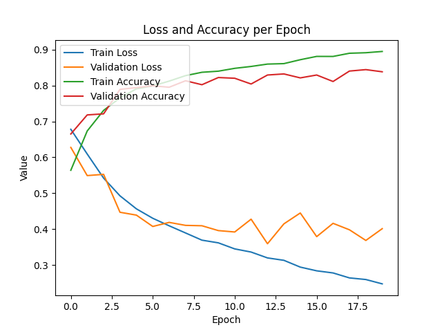

# Dog vs Cat CNN classifier


## Starting Guide

### 1. Obtain dataset
```shell script
wget "https://cainvas-static.s3.amazonaws.com/media/user_data/tanmay/dogvcat.zip"
unzip -qo dogvcat.zip
```


### 2. Build environment

#### 2.1. Build docker image
```shell script
docker build --tag cnn-classifier-image .
```

#### 2.2. Run docker container
```shell script
docker run --name cnn-classifier-container --volume %cd%:/app cnn-classifier-image
```

#### 2.3. Enter to the container in interactive mode
```shell script
docker exec -it cnn-classifier-container /bin/bash
```


### 3. Generate & Train & Evaluate model

#### 3.1. Generate model
```shell script
python generate_model.py \
    --model_output_path ./models/initial_model.h5
```

#### 3.2. Train model
```shell script
python train.py \
    --model_input_path ./models/initial_model.h5 \
    --model_output_path ./models/trained_model.h5 \
    --dataset_train_path ./datset/training \
    --val_data_ratio 0.2 \
    --epochs_number 20
```

#### 3.3. Evaluate model
```shell script
python evaluate.py \
    --model_input_path ./models/train_model.h5 \
    --dataset_path ./datset/testing
```


## Results

<p align="center">
  
</p>